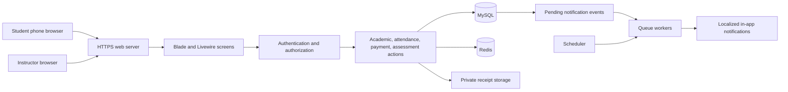
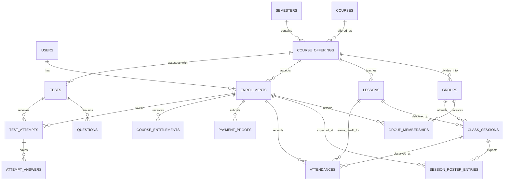

# Course Attendance and Assessment System — Project Requirements

**Recommended implementation:** one Laravel application with a mobile-first student portal and an instructor portal, using Blade, Livewire, and Tailwind CSS.

**Version:** 1.4 · **Prepared / updated:** 7 October 2026 · **Status:** Sprint 1 implemented locally; later sprints remain planned.

**Confirmed clarification:** every student receives their own first **two attended classes per course** free. The third class they attend requires payment approval or an explicitly recorded instructor exception.

**Confirmed updates:** the week starts Saturday; both English and Arabic are supported; students sign in with an Egyptian phone number or student code and password and must supply a WhatsApp-linked phone number. No email or phone ownership verification is required. Students may register a regular account, then sign in; there are no guest accounts, guest attendance, or unauthenticated course actions.

This document specifies the full product. Sprint 1 is implemented in this workspace with locked PHP and frontend dependencies, MySQL migrations, Docker services, automated checks, and a local HTTPS staging rehearsal. Sections 5.4–5.7 remain the implementation plan for Sprints 2–5. A public staging server, production hosting, and physical-device acceptance still require deployment choices and infrastructure.

**Project setup:** Docker Compose with Laravel Sail-compatible images is the implemented local environment, with container-based CI checks. Section 3.7 defines the setup and acceptance criteria. Production hosting is still selected separately.

Read by purpose:

1. [Business scope and rules](#1-business-scope-and-rules) — what the system must do.
2. [Functional requirements and screens](#2-functional-requirements-and-screens) — workflows and acceptance criteria.
3. [Technology and implementation design](#3-technology-and-implementation-design) — stack, architecture, and data model.
4. [Quality, testing, and operations](#4-quality-testing-and-operations) — release expectations.
5. [Sprints and decisions](#5-sprints-and-decisions) — delivery plan and assumptions to review.

## 1. Business scope and rules

### 1.1 Product objective

Allow an academic instructor to organize semester courses and groups, publish weekly class schedules, record attendance through class QR codes, approve payment receipts, and run scheduled online tests. Students complete all normal tasks from a phone browser.

The product should replace separate attendance sheets, receipt messages, and test links with a single student record for each course enrollment.

### 1.2 Scope and ownership

| Scope | Included behavior | Origin |
| --- | --- | --- |
| Academic organization | Semesters, courses, semester offerings, optional groups, and students enrolled in several courses | Requested |
| Teaching operations | Schedule classes before the week begins, manage changes, and track attendance | Requested |
| Student attendance | Sign in, then scan the class QR and record attendance; new students register a regular account before signing in | Requested and clarified |
| Payments and tests | Two free attended classes per course; upload receipts; instructor review; timed access to tests | Requested, with review workflow proposed |
| Supporting operations | Account recovery, announcements, CSV report exports, attendance corrections, audit history, reminders, and backups | Recommended for the first release |

Initial ownership is one instructor or one teaching business. Additional instructor accounts can be supported through course ownership checks, but a marketplace with separate organizations and subscriptions is outside this release. The instructor also performs administrative setup; there is no separate administrator portal in the initial scope.

**Confirmed launch baseline:** this is the system's first launch and no historical business data exists. Courses and groups are created through instructor setup; students register regular accounts and are enrolled through the normal authenticated workflows. Data import and historical-data migration are excluded from scope. History and audit records accumulate from actual use after launch.

**Deferred features:**

1. Online payment gateways, installments, refund processing, and accounting integration.
2. Native iOS/Android apps, offline attendance submission, and offline tests.
3. Automated programming-code execution, plagiarism detection, and remote exam proctoring.
4. Parent accounts, certificates, advanced learning analytics, and a full course-material library.
5. Automated SMS/WhatsApp/email delivery, push notifications, and a multi-organization subscription platform. Recording the required WhatsApp contact number is included; messaging integration is deferred.

Text-based coding questions may be answered and manually graded in the first release. Executing student code requires a separate isolated execution service and a separately estimated scope.

### 1.3 Shared vocabulary

| Term | Meaning and example |
| --- | --- |
| Semester | A dated teaching period, such as “Autumn 2026.” |
| Course | A reusable subject definition, such as “Data Structures.” |
| Course offering | A specific course taught in a specific semester by its owning instructor. Payment and enrollment belong here. |
| Group | A teaching group within an offering, such as A or B. An offering without visible groups uses an internal “General” group. |
| Enrollment | One student's membership in one offering. It retains payment status and attendance history across group changes. |
| Student code | A unique, system-issued account identifier used as an alternative login name. It is independent of university IDs and stays the same across courses and semesters. |
| Lesson | A teaching unit within an offering. Group A and B may attend separate sessions of the same lesson. |
| Class session | One scheduled meeting for one group, with its own date, location, and QR attendance window. |
| Attended class | One valid present/late attendance credit for an enrollment and lesson. This is the unit used for the two free classes. |
| Payment proof | A private uploaded receipt or invoice showing an external payment. The upload itself does not verify that payment occurred. |
| Test | A published assessment with an audience, opening time, closing time, duration, and grading rules. |

The lesson/session distinction prevents a student from receiving extra attendance credit by attending the same lesson with two groups. This is a proposed implementation rule; independent extra classes must have separate lesson identities.

### 1.4 Confirmed business rules

| ID | Rule | Practical consequence |
| --- | --- | --- |
| BR-01 | An instructor can teach several courses in a semester. | Each offering has separate rosters, schedules, tests, and payment records. |
| BR-02 | A student can enroll in several courses, with optional groups inside each. | One account serves all the student's enrollments. |
| BR-03 | Each student gets their first two attended classes free in each course. | Missing a scheduled class does not consume a free class; joining late does not remove the entitlement. |
| BR-04 | Payment is required beginning with the student's third attended class in that course. | The server checks previous valid attendance before allowing another attendance record. |
| BR-05 | Attendance requires a signed-in student account; tests are available only during their required time. | A signed-out QR visit leads to authentication, with fresh eligibility/token checks after sign-in. |

| ID | Confirmed update | Practical consequence |
| --- | --- | --- |
| BR-13 | The week starts Saturday, using the offering's configured timezone. Next week's schedule is due before Saturday 00:00. | Calendars, weekly reports, and reminders use Saturday–Friday regardless of UI language. |
| BR-14 | English and Arabic are both supported in the first release. | Both portals have translated UI and notifications, with left-to-right English and right-to-left Arabic layouts. |
| BR-15 | Students sign in with an Egyptian phone number or student code plus password and provide a WhatsApp-linked phone number. Neither email nor phone ownership verification is required. | No verification links, SMS/WhatsApp verification codes, or verification-based access gates. |
| BR-16 | Only instructor and student accounts exist. Students may register a regular account, then sign in. No guest accounts, attendance, or course actions are allowed. | Login and regular registration are authentication entry points; every course action, including attendance-intent creation, requires an authenticated account. |

### 1.5 Proposed rules that make implementation precise

These are recommendations, not additional instructions supplied by the instructor. They are the defaults used throughout the specification and sprint estimates.

| ID | Proposed default | Reason |
| --- | --- | --- |
| BR-06 | Free attendance and payment approval are scoped to a course offering: student + course + semester. Rejoining or changing groups keeps the same enrollment history. | Prevent accidental resets while allowing a new semester to have its own fee and trial. |
| BR-07 | Payment activates access to one offering, while the account remains usable for login, schedules, receipts, and personal history. | A student must be able to resolve a payment restriction, and unpaid course A must not block paid course B. |
| BR-08 | An instructor approves proof of full payment for that offering. Pending or rejected proofs do not unlock paid access. | Uploading a picture is not payment verification. |
| BR-09 | One active group per enrollment; transfers have an effective time. Present and late count as attended; absent and excused do not. | Keep group rosters and free-class counts predictable. |
| BR-10 | One full-course fee covers the offering. A reasoned, time-limited instructor waiver can temporarily permit access. | Keep first-release billing manageable while handling legitimate exceptions. |

| ID | Proposed default | Reason |
| --- | --- | --- |
| BR-11 | New tests can start while the student has used fewer than two attendance credits, or has approved payment/a valid waiver. An instructor can explicitly mark a test free for all enrolled students. | Defines test behavior during the free period; students without attendance could otherwise have unclear access. |
| BR-12 | A test already started retains its granted access until its deadline, unless the instructor explicitly invalidates it or suspends the account for a security reason. | A payment change or second attendance must not interrupt an existing attempt. |

BR-11 means a student can start a scheduled test before attending any classes, unless the test is explicitly configured as paid-only. The instructor should review this proposed test policy in the decision register before Sprint 4.

### 1.6 Payment and free-attendance examples

| Situation | Expected result |
| --- | --- |
| A new student joins when the course has reached its sixth scheduled class. | That student's first attendance is free class 1. |
| The student attends once, misses the next three sessions, and returns. | Their next valid attendance is free class 2. |
| The student has two valid attendance credits and uploads an unreviewed receipt. | Another check-in is blocked; show “Payment awaiting review.” |
| The instructor approves the receipt. | Further attendance and payment-gated tests are enabled for that offering. |
| The student has paid for Data Structures and has never attended Databases. | Data Structures is paid; Databases still has its own two free attendances. |
| The student moves from Group A to Group B after one attendance. | They have one free attendance remaining. |
| The student scans twice or refreshes the success screen. | Return the existing attendance; do not consume another free class. |
| An incorrect attendance is voided with an audit reason. | Recompute valid attendance count; restore a free allowance if appropriate. Never erase the correction history. |

### 1.7 Access rules

Account status, enrollment status, payment review status, and computed course access are separate concepts. Do not implement them as a single `is_active` field.

| Action | Trial: 0–1 previous attendances | Two attendances, no approved payment | Pending/rejected proof after two attendances | Paid or valid waiver |
| --- | --- | --- | --- | --- |
| Sign in, recover account, update profile | Yes | Yes | Yes | Yes |
| See published schedule, notices, own history and released results | Yes | Yes | Yes | Yes |
| Upload or inspect own payment proofs | Yes | Yes | Yes | Yes |
| Record a new attendance | Yes, consumes one allowance | No | No | Yes |
| Start a standard test during its window | Yes, while signed in | No | No | Yes, while signed in |

An explicitly free test bypasses the payment condition but still requires an authenticated student, an eligible enrollment, and a valid time window. A paid-only test requires payment or a waiver even during the student's free attendance period. These test access modes are proposed supporting behavior. No action depends on email, phone, or WhatsApp ownership verification.

Suspension overrides these permissions. Withdrawn/completed enrollments can view their historical records but cannot check in or start tests. A suspended account receives a support message and recovery/contact route; it cannot use normal course actions.

## 2. Functional requirements and screens

Every requirement below belongs to the first release unless explicitly deferred. IDs are used in sprint planning and acceptance testing. Existing IDs remain stable; numbering gaps reflect removed requirements.

### 2.1 Roles and authorization

| Capability | Authenticated instructor | Authenticated student |
| --- | --- | --- |
| Academic setup and weekly planning | Own offerings | Published schedule of own enrollments |
| Enrollment and groups | Manage own rosters | Join an allowed offering; request group change |
| Attendance | Open QR; inspect and correct own rosters | Record/view own attendance |
| Payments | Inspect/review proofs for own offerings | Submit/view own proofs |
| Tests and reports | Author, publish, grade, export own offerings | Take eligible tests; see own released results |

There is no guest role or temporary guest account. Signed-out visitors can only use login/regular registration and their language selector, and read static authentication/recovery instructions. These entry points grant no course permissions. Protected page requests redirect to login; unauthenticated mutation requests return an authentication-required response without creating enrollment, attendance, or intent records. QR links reveal no class details before authentication.

Every action and file download must check ownership on the server. Hiding a button does not grant protection. A changed URL, form field, or Livewire component property must never expose another student's record or another instructor's offering.

### 2.2 Accounts, registration, and recovery

| ID | Requirement | Acceptance criteria |
| --- | --- | --- |
| FR-ID-01 | Provide phone/student-code and password login with role-specific destinations. | A student can use either their normalized Egyptian login phone or their student code with the same password. Instructors use their Egyptian phone and password. Email login is disabled; no email/phone verification gate exists. |
| FR-ID-02 | Allow regular student registration before sign-in. | Require full name, Egyptian login phone, WhatsApp-linked phone, password, and password confirmation; issue a unique student code. Optional university/university ID can be completed later. Registration creates a regular student account and then shows sign-in; it creates no attendance, attendance intent, or enrollment. |
| FR-ID-03 | Prevent duplicate accounts and preserve enrollment identity. | Enforce unique normalized login phone and unique student code; equivalent local/international phone forms cannot create another account. Existing credentials require login or instructor-assisted recovery, never an automatic merge. Public registration cannot assign instructor privileges. |
| FR-ID-04 | Provide authenticated profile/password changes and instructor-assisted recovery. | Require current password for student password/login-phone changes; normalize and check uniqueness of the new phone without OTP verification. An authorized instructor can reset access after a documented account-ownership review, revoke old sessions, and require a new password on next login. No email/SMS/WhatsApp reset-verification flow. |
| FR-ID-05 | Protect authentication and handle suspension. | Throttle login by normalized account identity and connection without letting phone/code aliases bypass limits; use generic login failures. Instructor provisioning, resets, suspension/reactivation, and identity changes are controlled and audited. Instructor authenticator-app 2FA remains a proposed security option, with no email/phone verification dependency. |

#### Login and WhatsApp contact rules

Accept Egyptian mobile numbers in local form (`01` followed by nine digits) or international `+20`/`0020` form, normalize Arabic/Persian digit input and harmless display separators, and store one canonical international string. Initial mobile-prefix validation covers `010`, `011`, `012`, and `015`; after normalization the format is `+201[0125]` followed by eight digits. These correspond to the mobile ranges in the [Egypt numbering plan published by ITU from NTRA](https://www.itu.int/dms_pub/itu-t/oth/02/02/T020200003E0004PDFE.pdf). Reject wrong length, unsupported prefixes, and non-Egyptian login numbers. Validate format only; never send a code or claim the number's ownership has been verified.

Issue a student code at account creation, for example `STU-000123`; enforce uniqueness and case-insensitive lookup. It is an identifier, not a secret or a substitute for the password. Show it after registration and in the authenticated profile/instructor roster. Preserve it through phone changes, transfers, and semester changes. Do not provide a public code lookup or expose whether a phone/code exists through login errors.

The student must supply a number linked to their WhatsApp account. Offer “Use my login phone” or a separate contact field, and require the student to declare that the number is on WhatsApp. Store `whatsapp_phone` separately, in international format with Egypt preselected, so updating the login phone does not silently change the contact. The contact can equal the login phone and need not be unique across students; it is never a login identifier or recovery credential. No WhatsApp lookup, verification message, or ownership-confirmation workflow is required. Storing this contact does not require a WhatsApp API integration or authorize automated messaging.

Email is not required at registration or for any attendance, payment, test, or recovery action. Do not create email/phone verification statuses or `identity_pending` attendance flags. University IDs are separate optional academic identifiers, not the system student code.

#### Recovery without verification codes

An authenticated student changes their password using the current password. A student who has forgotten it follows the login screen's instruction to contact the instructor; there is no unauthenticated account-modification endpoint. The instructor identifies the existing student from their established roster/in-person context and performs an audited reset. Proposed implementation: issue a short-lived temporary password, deliver it directly to that student, revoke previous sessions, and require a replacement password before course actions. This is an administrative recovery action, not phone/email verification. Instructor recovery is handled by the deployment operator through a documented administrative process.

No bank credentials, national identity documents, or unrelated demographic data are requested.

### 2.3 Semesters, courses, groups, and enrollment

| ID | Requirement | Acceptance criteria |
| --- | --- | --- |
| FR-AC-01 | Create and archive semesters, courses, and offerings. | Validate dates; store instructor, timezone, fee, currency, and enrollment policy. Archive preserves attendance, payments, and grades. |
| FR-AC-02 | Manage optional groups and lesson identities. | Group names are unique inside an offering; optional capacity is enforced. Sessions of the same lesson across groups share a lesson ID. |
| FR-AC-03 | Enroll existing student accounts manually, by invitation, or through permitted authenticated QR enrollment. | One enrollment per student/offering; one active group. Self-enrollment requires sign-in, is available only if enabled, and respects capacity. Invitation/QR links grant no permission before authentication; returning students reuse their enrollment. |
| FR-AC-05 | Transfer, withdraw, and restore enrollments with history. | Group transfers affect future eligibility from their effective time, leave past records attached to the original group, and preserve course payment and free-class usage. |

An offering is `draft`, `open`, `completed`, or `archived`. An enrollment is `enrolled`, `withdrawn`, or `completed`; its payment access is calculated separately. Restoring a withdrawn enrollment retains its original ID and history. New attendance and test starts require an open offering. Do not complete/archive an offering while sessions or attempts remain active; resolve them first. Released history stays available to its owners.

Before classes exist, changing an offering's group structure is allowed. Once attendance exists, group deletion becomes archival. A transfer that would overlap another active membership is rejected. Students request a transfer; only the instructor approves it in the first release.

### 2.4 Weekly class scheduling

| ID | Requirement | Acceptance criteria |
| --- | --- | --- |
| FR-SC-01 | Build a Saturday–Friday weekly schedule before Saturday starts. | Select offering, group, lesson, start/end, location, and attendance window. Publish before Saturday 00:00 in the offering timezone; drafts remain private. Both UI languages use Saturday as the first day. |
| FR-SC-02 | Publish a week or selected sessions and notify affected students. | Publication is explicit; a repeat action creates no duplicate sessions or duplicate publication notices. Students see dates in the offering's timezone with a clear label. |
| FR-SC-03 | Detect conflicts and invalid times. | Reject end-before-start and dates outside the semester. Block instructor/group overlaps by default; student overlaps across courses appear as warnings. An instructor conflict override requires a reason. |
| FR-SC-04 | Reschedule, cancel, and copy a previous week's plan. | Copies create new drafts. Rescheduling preserves identity and history, revokes old QR credentials/intents, and notifies the current affected roster. Cancellation creates no absence or free-class consumption. |
| FR-SC-05 | Remind the instructor about unpublished schedules and students about upcoming classes. | Proposed instructor reminder: Thursday 18:00 for the week beginning that coming Saturday. Proposed student reminder: 24 hours before a published class. Late publication sends an immediate notice, not a reminder in the past. |

The system warns when a week begins without a published schedule, but permits late publication with an audit entry. Emergency changes must remain possible. Published classes with recorded attendance cannot be silently moved to another offering or group; correct them through an explicit audited operation.

Session lifecycle:

```text
draft -> published -> in_progress -> completed
draft/published -> cancelled
```

The attendance window is independent of the session lifecycle, allowing check-in shortly before class begins. Time-based boundaries apply even if a background job is delayed. A session is only marked delivered/completed by an instructor action; simply reaching its end time does not prove the instructor taught it. An abandoned session is flagged for resolution before absence finalization.

### 2.5 QR attendance

| ID | Requirement | Acceptance criteria |
| --- | --- | --- |
| FR-AT-01 | Show a rotating QR for one class session. | Only its instructor can display/open it. The QR contains an HTTPS URL and an unpredictable expiring token; no student data. Closed, cancelled, or revoked sessions reject it. |
| FR-AT-02 | Require authentication before starting attendance. | A signed-out scan redirects to login without revealing class data or creating an intent. A new student may register, then sign in. After login, revalidate the QR and show the class confirmation action; registration/login alone never records attendance. |
| FR-AT-03 | Enforce eligibility and the two-free-attendance rule atomically. | Validate group, enrollment, session, intent/token, identity, and payment. Duplicate/concurrent requests create at most one valid credit for a lesson; two simultaneous requests cannot spend the same remaining free allowance. |
| FR-AT-04 | Display attendance results and support instructor corrections. | Students receive course, class date, status, recorded time, and remaining free allowance. Manual mark/change/void needs a reason and retains actor, original values, new values, and timestamps. |
| FR-AT-05 | Produce a roster with present, late, absent, and excused statuses. | Finalize absences only for a delivered class and eligible roster, after authenticated attendance intents expire. A denied payment scan is visible as a reason but is never a successful attendance. |

#### Check-in flow

1. The student uses the phone's normal camera to open the QR URL. Authentication is checked before class details are displayed or any attendance work begins. A signed-out visitor is sent to login; the server may preserve only the intended internal destination, not an attendance intent or accepted scan time.
2. An existing student signs in using their phone/student code and password. A new student registers a regular account, then signs in. The destination may be restored, but the QR must still be valid at that time; otherwise request a fresh scan. Authentication grants no pre-login timing grace.
3. The authenticated student sees the course, group, and class and taps “Record attendance.” The server validates the current token and creates an intent bound to that user, browser session, and class; it then attempts check-in. Only this authenticated action can create/reuse an eligible enrollment when QR self-enrollment is enabled.
4. Inside one database transaction, the system checks the latest access state and writes or returns the attendance. If payment or enrollment is blocked, it gives the exact next step. No guest record, temporary identity, or anonymous attendance is created.
5. Only a committed server result produces the success screen. Refresh/retry returns that same record; an unknown network result says “Checking attendance status” until resolved.

#### Proposed attendance timing defaults

| Setting | Initial value | Enforcement |
| --- | --- | --- |
| Window opens | 15 minutes before class | Instructor may adjust for the session before opening. |
| Window closes | 30 minutes after class starts | Must not exceed class end; short classes use the earlier boundary. |
| Late threshold | 10 minutes after class starts | Server-accepted intent time determines present/late. Exactly at the threshold is late. |
| QR rotation / token validity | Rotate every 30 seconds; each token valid for 60 seconds | Short overlap permits scanning near a rotation. Explicit close/cancel/revoke overrides token validity. |
| Authenticated attendance-intent lifetime | Up to 2 minutes, capped at normal window close + 2 minutes | User must already be signed in when the intent is created with a valid token/window. Deliberate closure revokes it immediately; no registration/login grace exists. |

These values are configurable instructor settings, not user-confirmed business rules. Expiration checks use `now < expires_at`; at the exact expiry time a token or intent is invalid. Registration/login never reserves attendance or extends QR validity. If authentication outlasts the token, the signed-in student scans the current QR or requests instructor assistance.

A naturally elapsed attendance window can honor an already-issued intent until its capped deadline. An explicit instructor closure, reschedule, cancellation, or revocation cannot. Store both the intent acceptance time and final recording time so late classification is explainable.

#### Attendance eligibility and counting

```text
valid_attended_count = number of distinct lessons with a non-void present/late
                      attendance credit for this enrollment

may_record_new_attendance = authenticated student with active account
                           AND open offering
                           AND enrolled in the offering
                           AND eligible for this session/group
                           AND valid attendance window/token or existing intent
                           AND (
                             valid_attended_count < 2
                             OR approved payment
                             OR current instructor waiver
                           )
```

No email, phone, or WhatsApp verification gate applies. Authentication, enrollment, session eligibility, and trial/payment rules apply to every attendance, including the first two free classes.

Once a student's access to their own existing present/late attendance has been authorized, an attendance retry returns that record before reapplying today's payment, group, or QR-expiry rules. Otherwise, retrying the second free attendance could incorrectly fail because the count has just reached two. This exception does not permit a new record or modification, and does not treat an absent, excused, or void record as a successful check-in.

Lock the enrollment row when deciding and writing a new attendance. All alternate paths, including manual changes and voids, use the same counting rules. A second group session of the same lesson returns “Already attended this lesson” and does not grant another credit. An authorized makeup session is associated with the original lesson unless the instructor deliberately defines a new teaching unit.

Students cannot freely scan another group's QR to transfer themselves. The instructor can authorize attendance at another group's session for a particular lesson. The authorization does not change their normal group or duplicate their attendance obligation.

#### Absence and correction policy

The expected roster is captured when the attendance window opens from membership effective at that time. Valid enrollment through that session's QR adds the student to its roster. A later enrollment or group transfer does not create retrospective absences.

After the instructor confirms delivery and all valid intents expire, unresolved roster entries become absent. An excused record does not consume a free class. A payment-blocked student on the roster is absent with a separate `payment_required` reason unless the instructor records an excuse or exception. A cancelled/undelivered session is excluded.

An instructor may correct actual attendance, but a third-or-later attendance without approval requires an explicit waiver or a named payment exception in the same audited operation. Do not silently disable the payment rule in a manual-entry screen. Removing an earlier attendance recalculates the free count and leaves historical paid attendance intact.

#### QR limits and failure handling

Rotating codes limit reuse but do not prove physical presence: a student can still share a currently valid code with someone elsewhere. The first release uses short validity, instructor-visible rosters, identity review, and audit records. Mandatory GPS, facial recognition, and restrictive IP matching are excluded. Students on mobile data must be able to attend.

If the camera is unavailable, show a rate-limited short class code on the instructor screen, with the same validity and access checks, or allow instructor-assisted recording. A code is shared by the class, so one student's use must not invalidate it for everyone. Only each student's intent is single-use.

If connectivity fails, show “Attendance not confirmed” and allow a status check/retry. An instructor can later record attendance with its actual observed time and reason. No offline scan is silently treated as proof of attendance.

### 2.6 Payment proof and course access

| ID | Requirement | Acceptance criteria |
| --- | --- | --- |
| FR-PY-01 | Display fee, payment instructions, and access status per offering. | Student sees remaining free attendances and where/how to pay, including required reference information. Changing a fee does not rewrite an existing enrollment's agreed fee. |
| FR-PY-02 | Accept a private payment proof upload. | JPEG, PNG, or PDF up to 10 MB; collect amount, currency, payment date, method, and reference if available. Reject invalid files without losing other entered fields. |
| FR-PY-03 | Provide an instructor review queue. | Filter by offering/status; inspect proof and enrollment; approve or reject with a reason. Rejection is visible to the student with instructions to resubmit. |
| FR-PY-04 | Apply review decisions consistently. | Approving proof and creating course entitlement happen in one transaction. Repeated/concurrent review does not duplicate credit; approval for one course cannot unlock another. |
| FR-PY-05 | Handle resubmission, revocation, and temporary waivers. | Retain previous submissions; record reviewer/time/reason; notify the student. Revocation affects future access, preserves historical attendance/grades, and does not erase a receipt. |

Payment file and review lifecycles:

```text
file: uploaded -> quarantined -> safe OR rejected_file
review (safe file only): pending_review -> approved OR rejected
approved -> revoked
rejected/revoked -> new submission (new proof)
```

`quarantined` is a file-processing status. Unsafe/invalid uploads fail file processing and never enter the review queue. The payment decision status remains separate: pending, approved, rejected, or revoked. Resubmission creates a new proof; it does not rewrite the previous decision. Permit one open pending submission per enrollment to reduce duplicate work, while still preserving rejected/revoked history.

The instructor verifies the receipt against actual received funds outside the system. The application does not claim bank verification, issue a tax invoice, or execute a refund. A partial, wrong-currency, or wrong-course payment cannot automatically activate the offering. The instructor rejects it with guidance or creates a reasoned waiver; installments are deferred.

Payments may be submitted before the free classes are used. Approval provides course access through the offering's end, subject to enrollment/account status. Any extension is explicit. A fee of zero creates an audited zero-fee entitlement instead of requiring a fabricated receipt.

Store monetary values in integer minor units with currency; never use floating-point arithmetic for fees. The currency's decimal scale is explicit. Receipt reference/hash matches produce a review warning, not automatic rejection: repeated references and identical files require human interpretation.

Approval remains manual even if file checks succeed. Proposed operating target: review within 24 hours and clear pending receipts before a student's next paid class. The dashboard highlights overdue reviews.

#### Upload protection

Validate actual file type, extension, and size; use random storage names; keep files outside the public web directory; quarantine until malware checking completes; and authorize every download. Serve approved previews through safe image rendering or an isolated PDF viewer/download response. These controls follow the [OWASP file upload guidance](https://cheatsheetseries.owasp.org/cheatsheets/File_Upload_Cheat_Sheet.html).

The receipt screen explains accepted formats before upload. HEIC is not accepted in the initial server pipeline; offer a supported camera-generated image where available and clear guidance to use JPEG/PNG or PDF. Test actual iPhone uploads before release. A phone purchase or a desktop computer must not be required.

### 2.7 Timed tests and grading

| ID | Requirement | Acceptance criteria |
| --- | --- | --- |
| FR-EX-01 | Author and publish tests for an offering and optional selected groups. | Define title, instructions, opens/closes, duration, points, pass threshold, payment access mode, and result-release policy. Draft content and answer keys are not exposed to students. |
| FR-EX-02 | Support practical first-release question types. | Single-choice and true/false auto-grade; short answer and code-as-text support manual grading. Blank answers score zero; no negative marking by default. |
| FR-EX-03 | Enforce eligibility, attempt limits, and deadlines on the server. | Default one attempt per enrollment/test. Starting before opening or at/after closing is rejected. Parallel tabs cannot create extra attempts. |
| FR-EX-04 | Save answers and finalize submissions reliably. | Save changes with visible server acknowledgement; resume the same attempt after reload; submit/timeout only once; reject edits at/after the deadline. |
| FR-EX-05 | Grade, release, and correct results with history. | Objective scores remain provisional until manual grading finishes; students see only released results. Answer explanations appear only after the test closes and the instructor releases them. |

Test lifecycle is `draft -> published -> closed -> graded -> results_released`, with explicit cancellation before or after publication. Attempts are `in_progress -> submitted/timed_out -> graded`, with an audited `invalidated` exception. A test's window closing is effective by server time even before its stored lifecycle state updates.

Proposed first-release limits are 100 questions per test, 2–10 choices per single-choice question, and durations of 1–180 minutes. Validate positive points, pass threshold 0–100%, at least one question, and `closes_at > opens_at`. Individual accommodations can set a different closing time/duration before the student starts; the change is audited and visible to that student.

#### Deadline rule

```text
effective_deadline = min(
    attempt.started_at + allowed_duration,
    student_effective_closes_at
)
```

If a test opens at 14:00, closes at 15:00, and allows 30 minutes, a student starting at 14:50 has 10 minutes. Display that shortened time before starting. At exactly 15:00, a new start or answer write is rejected. A phone's clock never controls the deadline.

Opening the test instructions does not start the timer. “Start test” creates the attempt and its fixed deadline. At start, snapshot question version/order, scoring, audience eligibility, accommodations, and access decision. Resuming does not restart the timer. The first release uses fixed question order; randomized banks are deferred.

Existing published questions cannot change after any attempt begins. Corrections require a new test version or an audited grading adjustment applied consistently to affected attempts. Retakes require an instructor-granted additional attempt with reason and its own availability window; a normal refresh never grants a retake.

#### Answer saving and network loss

Save a changed answer after approximately one second of inactivity and when leaving the question. A dirty-answer heartbeat may retry at 10-second intervals. Show “Saving,” “Saved at [time],” or “Not saved — retry” based on the server response. Use answer revisions to prevent a delayed request from overwriting newer content.

The student may continue editing the currently loaded screen during a short connection loss, but unsent answers are explicitly marked unsaved and are accepted only if they reach the server before the deadline. The first release does not promise persistent offline drafts. Warn before navigating away with unsaved changes.

At timeout, finalize only answers already accepted by the server. A scheduled task performs cleanup, while every answer/save/submit request independently enforces the deadline. Queue delay must never extend test access. In a platform outage, the instructor can invalidate an attempt and grant a documented replacement window; a device clock or client-side submission timestamp is not trusted.

Proposed grading defaults: one selected correct choice earns the question's full points; incorrect/blank earns zero. Manual graders award 0 to the maximum points with optional feedback. Percentage is total awarded points divided by total available points, displayed to two decimals; pass/fail compares the unrounded value to the stored threshold. Unfinished manual grading displays “Awaiting grading,” not a final failure.

### 2.8 Notifications and announcements

| ID | Requirement | Acceptance criteria |
| --- | --- | --- |
| FR-NT-01 | Provide a localized in-app notification center. | Student/instructor sees notices in their selected English/Arabic language, unread status, and a link to the authorized screen. Delivery-job failure does not undo attendance, payment review, or test submission. Email and messaging providers are not required. |
| FR-NT-02 | Notify schedule publication, changes, cancellation, and upcoming classes. | Target affected current enrollments; rescheduled reminders are replaced; old reminders cannot announce obsolete times. |
| FR-NT-03 | Notify payment submission and review outcomes. | Instructor sees pending reviews; student sees approval/rejection/revocation and a clear next step in-app. Receipts remain behind authorized private-file access. |
| FR-NT-04 | Notify test publication, upcoming availability, and released results. | Proposed opening reminder: one hour before; publish inside that hour sends one immediate notice. Cancelled tests do not send stale reminders. |
| FR-NT-05 | Allow simple offering/group announcements. | Instructor creates plain text or sanitized limited formatting; recipients are scoped to that offering/group. No student contact details are revealed to other students. |

In-app records are the durable source of notification history. Dispatch notification jobs after the related database transaction commits, retry failures with bounded backoff, and show delivery failures to the operator. Use an event/recipient/channel key to avoid duplicate deliveries. Store message keys and parameters so standard notices render in the user's current language. There is no required email address or automated WhatsApp/SMS channel in this release; the required WhatsApp field is contact information only. In-app reminders become visible when the user opens the system and do not promise an external alert while it is closed.

### 2.9 Dashboards, reports, and audit

| ID | Requirement | Acceptance criteria |
| --- | --- | --- |
| FR-RP-01 | Provide an instructor dashboard. | Show today's classes, next-week publication status, pending receipts, attendance issues, and tests needing grading. Counts link to filtered records. |
| FR-RP-02 | Provide a student dashboard. | Show next class, course cards, remaining free attendances/payment state, available tests, and unread notices. Each card has a clear primary action. |
| FR-RP-03 | Report attendance per student, session, group, and offering. | Filter by semester/date/status; distinguish present, late, absent, excused, and payment-blocked scans. Transfers and late joins do not distort expected classes. |
| FR-RP-04 | Report payment approvals and test outcomes; export CSV. | Separate submitted amounts from approved totals; show currency separately; authorize exports and escape spreadsheet formula prefixes. Never label unverified receipts as collected revenue. |
| FR-RP-05 | Maintain an audit trail and archive completed periods. | Review actor/time/reason for attendance changes, enrollment transfers, payment decisions, waivers, schedule changes, grading, and suspensions. Archiving does not remove historical evidence. |

Attendance percentage is `(present + late) / (present + late + absent) × 100` over delivered, finalized eligible sessions. Excused and cancelled sessions are excluded; zero denominator displays “N/A.” Count at most one obligation/credit for the same lesson per student, including authorized makeup sessions. Reports show the numerator and denominator so the percentage is understandable.

Payment reports summarize instructor-approved evidence of external payments; they are not a complete accounting ledger. Test reports distinguish not eligible, not started, in progress, awaiting grading, passed, failed, and invalidated. The first release does not automatically expel students based on an attendance percentage.

### 2.10 Mobile interface requirements

| Interface area | Required screens | Mobile behavior |
| --- | --- | --- |
| Entry and identity | Register, phone/code login, authenticated profile/password change, recovery instructions, authenticated QR landing | Language selector, phone keyboard and code-friendly input; no verification screen. Class details and intent creation appear only after sign-in; no forced app installation. |
| Student learning | Home, My Courses, course detail/schedule, attendance history, tests/results | Agenda and cards; status in words; large primary action; no desktop-only table dependency. |
| Student payment | Fee instructions, upload, preview, submission status, rejection details | Choose image/PDF, see upload progress, retry, and verify the destination course before submit. |
| Instructor operations | Dashboard, course/group roster, weekly planner, QR display, attendance review | Responsive tables with focused detail screens; large QR projection mode; agenda alternative to calendar grids. |
| Instructor assessment/billing | Receipt review, test builder, grading, reports/settings | Save draft state; explicit approval/publish actions; confirmation for destructive operations. |

Student bottom navigation has four destinations: Home, Courses, Tests, and Profile. Course detail contains schedule, attendance, and payment. QR is an entry into the relevant class, not an obligation to navigate through several menus first.

Attendance result messages must distinguish “Recorded,” “Already recorded,” “Payment required,” “Payment awaiting review,” “Wrong group,” “QR expired,” and “Not confirmed — connection lost.” Every unsuccessful state names the action available to the student or instructor. Do not display internal stack traces or database errors.

Forms use visible labels, field-level errors, suitable phone/student-code keyboards, and readable text. Primary touch targets should be at least 44 × 44 CSS pixels. Support screen readers, keyboard operation, 200% text zoom, and non-color status indicators. During tests, the timer and save status remain visible without covering the question or mobile keyboard.

### 2.11 English and Arabic support

| ID | Requirement | Acceptance criteria |
| --- | --- | --- |
| FR-LC-01 | Deliver complete English and Arabic interfaces. | Both portals and authentication screens have translated navigation, forms, errors, statuses, and test controls; no missing translation keys appear in core workflows. |
| FR-LC-02 | Support right-to-left Arabic and left-to-right English. | Responsive layouts, focus order, icons, and mixed-direction content work on phones; numbers, student codes, URLs, and source code retain their correct order. |
| FR-LC-03 | Persist and safely switch the selected language. | Store account preference and pre-login locale; switching preserves screen/form/attempt state and does not submit attendance, lose answers, or reset deadlines. |
| FR-LC-04 | Localize display while preserving data and calendar rules. | Accept Arabic/Western numeric input; dates and amounts retain the same stored values; both languages use Saturday–Friday weeks. Academic text and answers are preserved without automatic translation. |
| FR-LC-05 | Localize notifications, reports, and exports. | Standard notices and report labels use the selected language; CSV preserves Arabic names/content. Permissions and report totals are identical in both languages. |

Both languages are required for the complete student and instructor interfaces, including authentication, validation/errors, attendance/payment states, calendars, test controls, notifications, reports, and CSV column labels. English uses `lang="en"` and left-to-right layout; Arabic uses `lang="ar"` and right-to-left layout. The language selector is available on authentication screens and within both portals; persist the chosen language in the account after sign-in and in a locale preference before sign-in.

Use the browser's supported language on first visit, with English as the proposed fallback. Switching language must preserve the current screen, entered form values, saved/unsaved test answers, and the original attempt deadline; it must not cause another attendance submission. Localize dates, weekdays, labels, and numbers while keeping Saturday as the start of the week and the same underlying timezone/UTC values.

Use layout-direction-aware spacing and alignment. Keep phone numbers, student codes, URLs, and programming code in isolated left-to-right regions inside Arabic pages so their order remains correct. Accept Arabic and Western numerals in phone/date/amount inputs, then normalize before validation and storage. Test text expansion, mixed Arabic/English names, touch navigation, timers, tables, and file upload on real phones in both languages.

Instructor-authored course names, questions, answer options, announcements, and feedback may be written in Arabic, English, or both. Preserve the original content with appropriate text direction; the interface language selector does not automatically translate teaching content or student answers. Store UTF-8 data and export CSV that preserves Arabic characters.

## 3. Technology and implementation design

### 3.1 Recommended technology stack

Use a **Laravel application with Blade + Livewire**, often called the TALL stack when combined with Tailwind CSS and Alpine.js. Laravel handles the backend and renders the frontend. Small amounts of browser JavaScript handle local interactions such as timers and upload progress; business decisions remain in PHP on the server.

This is a design recommendation for this project's forms, schedules, approvals, and tests. It gives one team one codebase, one deployment, and shared validation and authorization.

#### Application and interface

| Layer | Recommendation | Why it fits | Trade-off or condition |
| --- | --- | --- | --- |
| Runtime | PHP 8.5, latest compatible patch, inside the development container | A current supported runtime with the same PHP version available to every developer. | Verify image/extensions/package compatibility in Sprint 1; PHP 8.4 is a supported fallback if needed. Keep CI and production on the agreed PHP version. |
| Backend | Laravel 13.x, latest compatible patch | Provides routing, validation, authentication foundations, database access, queues, and scheduling in one PHP framework. | Pin dependencies and plan regular maintenance. |
| Frontend | Blade templates + Livewire 4 + its bundled Alpine.js | Build interactive forms, dashboards, and test screens while keeping application behavior in PHP. Alpine handles small local interactions. | Livewire actions need a network round trip; debounce saving and avoid unnecessary rerenders. |
| Styling | Tailwind CSS 4 and reusable Blade components with direction-aware layouts | Consistent responsive English/LTR and Arabic/RTL screens. Use the Livewire starter kit as a base. | Test both directions and actual student browser support; avoid requiring paid UI components. |
| Asset build | Vite, with the starter kit's compatible Node.js toolchain | Compiles and optimizes CSS and JavaScript. | Node is needed for development/builds, not a separate production frontend server. |

Laravel 13 supports PHP 8.3–8.5 and is listed for security fixes through 17 March 2028. PHP 8.5 is listed for active support through 31 December 2027. These dates support choosing them for a new project; they do not replace package compatibility checks. [Laravel release policy](https://laravel.com/framework/docs/releases), [PHP supported versions](https://www.php.net/supported-versions.php).

The official Livewire starter kit uses Livewire 4, Tailwind, and Flux UI and supplies authentication through Fortify. Livewire bundles Alpine, so do not add a second Alpine instance. Build custom course screens from this starting point. [Laravel starter kits](https://laravel.com/docs/13.x/starter-kits), [Livewire installation](https://livewire.laravel.com/docs/4.x/installation).

Adapt the starter kit to the confirmed account rules: replace email login with normalized Egyptian phone/student-code lookup, customize registration to collect WhatsApp contact and generate a student code, disable email-verification and email-reset routes/middleware, and route registration to sign-in. Keep CSRF/session protection and password hashing. Use Laravel language files under `lang/en` and `lang/ar`, persisted locale selection, and direction-aware Blade components for both portals.

Tailwind 4 documents minimum browser versions of Safari 16.4, Chrome 111, and Firefox 128. These are a CSS compatibility floor, not proof that every application feature works on every such phone. Survey student devices and test them in Sprint 1. If older devices are common, choose a compatible CSS approach before implementation; Tailwind's migration guide identifies 3.4 as an option for older browsers. [Tailwind compatibility](https://tailwindcss.com/docs/compatibility), [Tailwind upgrade guide](https://tailwindcss.com/docs/upgrade-guide).

#### Data and background services

| Layer | Recommendation | Why it fits | Trade-off or condition |
| --- | --- | --- | --- |
| Main database | MySQL 8.4 LTS with InnoDB and `utf8mb4` | Relational constraints and transactions fit enrollments, receipts, attempts, and attendance. Unicode storage handles student names. | Use the same database engine in integration tests; SQLite-only tests do not prove MySQL locking behavior. |
| Cache, sessions, and queues | Redis with Laravel's standard drivers | Handles shared sessions, rate limits, QR token lookups, and background work without putting each transient task in the main database. | Adds an operated service; the database remains authoritative for attendance, entitlement, and grades. |
| Private file storage | Private S3-compatible object storage through Laravel Filesystem | Keeps receipts outside public assets and separates files from application deployments. | Needs access controls, retention rules, and tested backups; a private local disk is acceptable for development. |
| Notifications | Laravel database notifications and queued jobs | Delivers localized in-app notices without requiring email addresses or verified phone numbers. | No external delivery provider is required; automated WhatsApp/SMS/email delivery is deferred. |
| Scheduled work | Laravel Scheduler + supervised queue workers | Handles reminders, timeout cleanup, reporting jobs, and retention tasks. | Worker health must be monitored; synchronous requests still enforce all time/access rules. |

MySQL's LTS release model favors stable features and fixes within a release series; 8.4 is selected as a compatible baseline, without assuming it is the newest available series. Laravel supports MySQL and database transactions. [MySQL LTS policy](https://dev.mysql.com/doc/refman/8.4/en/mysql-releases.html), [Laravel database documentation](https://laravel.com/docs/13.x/database).

Laravel supports queue dispatch after a database transaction commits and storage through local/S3 disks. Use these capabilities to send notifications only after successful writes and keep receipt access controlled. [Laravel queues](https://laravel.com/docs/13.x/queues), [Laravel file storage](https://laravel.com/docs/13.x/filesystem).

#### QR, testing, and hosting

| Layer | Recommendation | Why it fits | Trade-off or condition |
| --- | --- | --- | --- |
| QR generation | `endroid/qr-code` through Composer, with a compatible locked release | Generates the class QR inside the PHP application. | The library renders a code; application services must still implement expiry, revocation, and access checks. |
| QR scanning | Phone's native camera opens the HTTPS attendance URL | No app installation or embedded camera dependency for the normal journey. | Test real phones; provide the short-code/manual fallback. An embedded scanner can be added later. |
| Automated quality | PHPUnit or Pest, Livewire component tests, Playwright browser tests, Pint | Checks PHP behavior, full student journeys, and coding consistency. | Emulated phones do not replace camera/upload checks on real hardware. Select one PHP test style in Sprint 1. |
| Production | Linux hosting with Nginx, PHP-FPM, managed worker/scheduler processes, and managed MySQL/Redis where practical; a hardened application image if container hosting is selected | Supports the same Laravel application and runtime dependencies used in development. | Select hosting in Sprint 1; use deployment-specific configuration, with no Sail/Vite development server in production. |
| Setup and delivery | Docker Compose + Laravel Sail locally; Git, container-based CI, isolated staging, and repeatable releases | Gives developers a consistent environment and makes each sprint demonstrable. | Commit setup instructions and versioned configuration; CI uses isolated synthetic data, never real receipts or production volumes. |

The QR package is documented by its maintainer. If an embedded scanner is later added, browser camera access needs a secure context such as HTTPS. [Endroid QR Code](https://github.com/endroid/qr-code), [MDN camera access](https://developer.mozilla.org/en-US/docs/Web/API/MediaDevices/getUserMedia).

Playwright supports mobile device emulation; use it alongside physical Android and iPhone testing. Production configuration should follow the framework's deployment guidance. [Playwright emulation](https://playwright.dev/docs/emulation), [Laravel deployment](https://laravel.com/docs/13.x/deployment).

### 3.2 Why this frontend approach

| Option | Fit for this project | Decision |
| --- | --- | --- |
| Blade + Livewire + Alpine | PHP-first development; strong fit for forms, approval queues, calendars, and normal online tests. | Recommended. Use small local JavaScript for timers, dirty-answer state, and progress indicators. |
| Blade with traditional form submissions | Small dependency surface and straightforward PHP rendering; more work for autosave and dynamic instructor screens. | Suitable for simple pages inside the recommended app, but insufficient alone for the full interaction requirements. |
| Laravel + Inertia with Vue/React | Suitable for extensive client-side state, especially with a JavaScript-focused team. | A valid future choice, but adds a separate frontend programming model beyond the requested PHP-first approach. |

A responsive web app is enough for the first release. A home-screen icon and manifest can be added during final polish. Installing it is optional. Do not cache authenticated pages, QR credentials, receipts, test content, or answers in a service worker. A home-screen shortcut does not imply offline support.

### 3.3 Application architecture

Keep one deployable Laravel application, organized into business areas. This is a modular monolith: the code has clear internal boundaries while sharing one database and deployment.



| Business area | Owns | Example action |
| --- | --- | --- |
| Identity and access | Phone/code credentials, WhatsApp contact, roles, recovery, locale, policies | `RegisterStudent`, `ResetStudentPassword`, `SuspendStudent` |
| Academics and scheduling | Semesters, offerings, groups, enrollments, lessons, sessions | `PublishWeek`, `TransferEnrollment` |
| Attendance | QR credentials/intents, expected rosters, credits, corrections | `RecordAttendance`, `FinalizeSessionAttendance` |
| Payments | Fee snapshots, receipt review, course entitlements, waivers | `SubmitPaymentProof`, `ApprovePaymentProof` |
| Assessments and communication | Tests, attempts, answers, grades, notices, reports | `StartAttempt`, `SaveAnswer`, `ReleaseResults` |

Controllers and Livewire components collect validated input and invoke these actions. Actions own business decisions and transactions. Laravel policies check who can access each resource; reusable validators handle payload shape. [Laravel authorization](https://laravel.com/docs/13.x/authorization).

Expected code locations are `app/Actions/{Identity,Academics,Attendance,Payments,Assessments}`, `app/Policies`, `app/Models`, `app/Jobs`, `app/Notifications`, `lang/{en,ar}`, and `resources/views/{student,instructor,components}`. These are proposed conventions, not existing files. Avoid introducing a generic repository layer unless a concrete need appears.

Both interfaces use the same origin and Laravel session cookies, CSRF protection, and server-rendered routes. A public REST API, JWT authentication, and separate SPA hosting are unnecessary for this release. If an API is added later, it should call the same business actions.

### 3.4 Data model

The following is the minimum conceptual schema. Normal timestamps, primary keys, foreign keys, and audit fields apply even when omitted from a row. Production migrations must add indexes and validated state constraints; this document is not executable SQL.

#### Identity and academic structure

| Entity | Essential data | Important constraints |
| --- | --- | --- |
| `users` | Role, full name, normalized Egyptian login phone, student code, password hash, account status, preferred locale (`en`/`ar`), password-change-required flag and temporary-password expiry | Unique login phone; unique student code required for students; registration assigns student role. No required email or email/phone verification fields. |
| `student_profiles` | User, required `whatsapp_phone`, WhatsApp self-declaration time, university, optional institution student ID | One profile per student; contact is not a login/recovery identifier; university ID is separate from student code. |
| `semesters` / `courses` | Owner, name/code; semester date range; archive state | Stable IDs; course code unique within its owner. |
| `course_offerings` | Course, semester, instructor, timezone, default fee/currency, state, enrollment policy | Offering is the scope for permissions, fees, free attendance, and tests. |
| `groups` / `lessons` | Offering, group name/capacity; lesson title/order | Unique group name within offering; same lesson can have sessions for several groups. |

#### Enrollment, schedule, and attendance

| Entity | Essential data | Important constraints |
| --- | --- | --- |
| `enrollments` / `group_memberships` | Student, offering, status, joined/withdrawn times, agreed fee snapshot; group effective start/end | Unique student/offering; non-overlapping group membership periods. |
| `class_sessions` | Offering, group, lesson, scheduled start/end, location, publication/delivery state, attendance settings, QR revision | Group and lesson must belong to the same offering; prevent duplicate active group/lesson meetings unless deliberately modeled as separate lessons. |
| `session_roster_entries` | Session, enrollment, eligibility source, group snapshot, expected/excused status | Unique session/enrollment; preserve historical expectations and explicitly link makeup attendance. |
| `attendance_intents` / `qr_credentials` | Session, token hash or credential reference, issued/expiry/revocation time; authenticated student ID, browser binding, acceptance time, consumed time | Intent user is required at creation and cannot be reassigned; no anonymous intents. Never log raw tokens; each intent consumable once; QR is shared by the class. Expiring QR credentials may live in Redis. |
| `attendances` / `attendance_revisions` | Enrollment, lesson, actual session, present/late/absent/excused/void status, observed/recorded time, method, access decision | Enrollment must belong to an existing student; no guest identity or verification-pending flag. One canonical record per enrollment/lesson with audited corrections. |

Use the existing canonical attendance record when correcting or restoring a voided lesson attendance. A normal duplicate succeeds only if a non-void present/late attendance already exists; a voided record requires a fresh valid check-in or authorized correction. Absent/excused records are not successful duplicates. Absence changes to present update that record and its audit trail instead of inserting a competing credit.

Absence finalization uses roster obligations grouped by enrollment/lesson, so an authorized makeup does not create a second absence. Keep attempted/denied check-ins in a separate short-retention log with reason codes. They are not attendance credits.

#### Payments and entitlement

| Entity | Essential data | Important constraints |
| --- | --- | --- |
| `payment_proofs` | Enrollment, private file key, detected MIME/size/hash, scan status, claimed amount/currency/date/method/reference, review state | One current pending proof per enrollment enforced transactionally; claims remain separate from reviewer-confirmed values. |
| `payment_reviews` | Proof, reviewer, decision, confirmed amount/currency, reason, time | Append-only decisions; a proof has one effective approval; rejection/revocation requires reason. |
| `course_entitlements` | Enrollment, source proof or zero-fee decision, valid-from/until, revocation details | Scope to one enrollment; overlapping grants must not duplicate financial totals. |
| `access_waivers` | Enrollment, covered actions, start/end, reason, issuing instructor | Expiry is checked on every new protected action, even if cleanup has not run. |
| `stored_files` | Owner/context, storage key, content type, size, scan state, retention date | Private by default; only safe files can be previewed/downloaded by an authorized actor. |

#### Assessments

| Entity | Essential data | Important constraints |
| --- | --- | --- |
| `tests` / `test_audiences` | Offering, selected groups or whole offering, version, opens/closes, duration, access mode, pass threshold, result policy/state | Groups belong to the offering; published content/version is frozen once attempts exist. |
| `questions` / `question_options` | Test version, type, prompt, order, max points, choices, correct choice or grading guide | Answer keys never serialized to student screens or Livewire public state. |
| `test_attempts` | Test version, enrollment, attempt number, started/deadline/submitted times, status, access snapshot, score/release state | Unique test/enrollment/attempt number; lock start permission so concurrent requests return the same current attempt. |
| `attempt_answers` | Attempt, question, response, revision, saved-at, awarded points, grader feedback | Unique attempt/question; question must belong to the attempt's frozen test version; reject stale revisions. |
| `attempt_permissions` / `grade_revisions` | Enrollment/test, extra attempt or accommodation, allowed window, reason; score before/after, actor/time | Additional attempts and grading changes are explicit and auditable. |

Audience membership is evaluated when starting: a student must currently belong to a selected group or the test must target the whole offering. New enrollments can take an already-published test if otherwise eligible. A transfer during an attempt does not change that attempt's snapshot or deadline. Students cannot evade a prior attempt limit by changing groups.

#### Communication and auditing

| Entity | Essential data | Important constraints |
| --- | --- | --- |
| `announcements` | Offering/optional group, author, safe content, publication time | Audience authorization on read and write. |
| `notifications` | Recipient, type, related resource, translation key/parameters, read time | Render standard notices in recipient's current locale; no raw QR credentials or receipt images. |
| `notification_events` / `delivery_attempts` | Event identity, recipients, in-app channel, pending/sent/failed state, attempts | Durable pending event written in the same transaction as the business change; dispatcher retries undispatched events. |
| `audit_events` | Actor, action, target, permitted before/after fields, reason, server time, request ID | Append-only through application permissions; redact secrets, passwords, full tokens, and private file content. |
| Framework support tables | Jobs/failed jobs where used, sessions if database-backed | Match configured drivers; apply expiry/operator access controls. Disable the unused email-password-reset and verification features. |

#### Core relationships



The diagram shows the central relationships; it omits revision and delivery tables for readability. Validate matching offering ownership across every related group, session, lesson, enrollment, payment, and test, using composite foreign keys where practical and transactional checks elsewhere.

### 3.5 Transaction and time rules

| Operation | Required atomic behavior | Retry behavior |
| --- | --- | --- |
| Record attendance | Lock enrollment; recheck authoritative count/access; lock session/intent as needed; write credit, consumed intent, and audit. | Return existing successful record; a retry never spends another allowance. |
| Review payment | Lock proof and enrollment in a consistent order; write review/entitlement/audit and pending notification event together. | Repeating the same decision returns its result; a conflicting later decision uses a separate revocation/review action. |
| Start a test | Lock enrollment/test attempt allocation; check window/audience/access; snapshot and create once. | Return current attempt until finalized; additional attempts require permission. |
| Save or submit | Lock attempt and relevant answer; compare deadline/revision; apply save or one finalization. | Duplicate submission returns its receipt; stale answer versions return a conflict without overwriting. |
| Transfer/publish | Validate roster/time conflicts and ownership before commit; record changes and pending notifications. | Stable operation keys prevent repeat transfers, duplicated sessions, or repeated internal notifications. |

Choose and document one consistent lock ordering before implementation to prevent deadlocks across attendance, approval, and transfer paths. A retry after a deadlock repeats the whole action and still respects uniqueness. Transactions hold database locks only; external file scanning and notification delivery happen outside them.

Store event timestamps in UTC and each offering's IANA timezone, such as `Africa/Cairo` when the instructor selects it. Convert local schedule input to UTC with daylight-saving validation. Store both the effective UTC time and intended timezone context. Reject ambiguous/nonexistent local times until the instructor resolves them. Browser clocks supply display hints only.

Calculate a teaching week as the half-open local interval from Saturday 00:00 to the following Saturday 00:00, then convert each boundary to UTC. Reports, schedule copies, and publication reminders use this same rule; do not assume a fixed UTC offset or let switching English/Arabic change the week boundary.

### 3.6 Proposed route and action boundaries

Route names below are implementation examples, not a promise of a public API contract. Livewire component actions may implement some mutations behind its own transport.

| Surface | Illustrative routes | Required checks |
| --- | --- | --- |
| Authentication and account management | `GET/POST /login`, `GET/POST /register`; authenticated profile/password actions and instructor reset action | Only login/regular registration are public mutations; throttle, normalize phone/code, and enforce student role on registration. No verification or email-reset routes. |
| QR attendance | `GET /attend/{token}`, `POST /attendance-intents`, `POST /attendance-intents/{intent}/complete` | Authentication before data/intent access; token lifecycle; CSRF; enrollment; access; idempotency. Signed-out GET redirects, POST is rejected. |
| Student portal | `/student`, `/student/courses/{enrollment}`, `/student/payment-proofs`, `/student/tests/{test}` | Student ownership and per-action entitlement; private downloads always authorized. |
| Instructor portal | `/instructor`, `/instructor/offerings/{offering}/schedule`, `/attendance`, `/payments`, `/tests` beneath an owned offering | Instructor role plus ownership; reasoned changes; scoped queries. |
| Test attempts | `POST /tests/{test}/attempts`, answer-save and submit actions under `/attempts/{attempt}` | Current owner; test version; server deadline; answer revision; submission state. |

Reject invalid fields with actionable messages. Distinguish unauthenticated, unauthorized, expired, validation, and concurrency-conflict states. Protect bearer QR tokens from application logs, analytics, referrer leakage, and browser prefetch effects; use no-store responses and avoid third-party assets on QR landing pages.

### 3.7 Docker setup and environment requirements

**Recommended baseline:** Docker Compose with Laravel Sail for local development. Sail provides Laravel-oriented commands over a Docker development environment and supports PHP 8.5. Developers use Git, Docker Engine or Docker Desktop, and the Compose V2 plugin; Windows development uses WSL2. Host installations of PHP, Composer, Node.js, MySQL, and Redis are not prerequisites for the documented setup. [Laravel Sail documentation](https://laravel.com/docs/13.x/sail).

This fits the project because PHP extensions, database versions, queue workers, and asset tooling can be configured once and reproduced across development machines. It adds Docker resource usage and image-build time, so verify the team's operating systems and CPU architectures during Sprint 1. Compose describes services, networks, and volumes together. [Docker Compose application model](https://docs.docker.com/compose/intro/compose-application-model/).

#### Setup deliverables and acceptance criteria

| ID | Requirement | Acceptance criteria |
| --- | --- | --- |
| ENV-01 | Provide a documented setup from a clean checkout using Docker. | Commit `compose.yaml`, `.env.example`, any required Docker build files, and a setup guide/script. A developer with Git and Docker can install dependencies, start the app, create the schema, and sign in without host PHP/Node/database services. |
| ENV-02 | Run the required development services consistently. | App, MySQL, Redis, worker, and scheduler start from the documented workflow; Vite runs in a container for asset development. PHP extensions and package/image versions are explicit and compatible with the stack. |
| ENV-03 | Preserve local data and isolate configuration. | Named volumes or documented persistent mounts retain database/receipt data across ordinary stop/start and container recreation. `.env` and secrets stay out of Git/images; local, test, staging, and production resources are distinct. |
| ENV-04 | Run checks in a reproducible container environment. | CI installs locked dependencies, builds assets, runs PHP/Livewire checks and browser tests against isolated services, and fails if schema setup, health checks, or required tests fail. Test cleanup cannot target development or production data. |
| ENV-05 | Document readiness, lifecycle, and deployment differences. | A fresh-setup rehearsal proves service readiness, job execution, scheduler heartbeat, and data persistence. Production uses its selected runtime configuration; if containerized, deploy a hardened image with separate web/worker/scheduler roles and a tested rollback. |

#### Development services

Service names below are proposed Compose names. Worker/scheduler/Vite entries are project additions; do not assume Sail generates these processes automatically.

| Service | Responsibility | Configuration and persistence |
| --- | --- | --- |
| `laravel.test` | Serve Laravel/Livewire and run PHP, Composer, and Artisan commands | PHP 8.5; required extensions; source mounted for development; writable storage/cache with host-user-compatible permissions. |
| `mysql` | Store application and integration-test data in separate databases | MySQL 8.4; named data volume; health check; app connects using `DB_HOST=mysql`. |
| `redis` | Cache, sessions, queue transport, and rate limiting | Pinned compatible image; configured persistence for local lifecycle tests; health check; `REDIS_HOST=redis`. |
| `queue` and `scheduler` | Run queued jobs and scheduled tasks as separate services using the same application image/code | Explicit worker command and a single scheduler process; restart behavior and logs documented. Development may use `php artisan queue:work` and `php artisan schedule:work`. |
| `vite` | Run the containerized Node/Vite development process | Use the project's compatible Node version and locked packages; configured browser-reachable asset/HMR address. Production receives compiled assets. |

Private receipt storage can use a persistent private local directory during development. All app/worker processes that handle files must share access to that directory. Validate the selected S3-compatible storage on staging before release. Add the file-scanning service or endpoint needed for receipt quarantine in Sprint 3; the default development stack does not require an email service.

Commit image version constraints and dependency lockfiles; avoid floating `latest` tags. Choose compatible patches, PHP extensions, and a Node version in Sprint 1 and update them deliberately. Container connections use Compose service names; `localhost` inside a container refers to that container, not the host database. Publish only needed browser ports by default; optional database debugging ports bind to the local machine.

#### First-run and daily workflow

1. Clone the repository and copy `.env.example` to a local `.env`, setting local ports and credentials. The guide must state the tested Docker/Compose versions and any OS-specific prerequisites.
2. Run the supplied bootstrap script to install Composer dependencies with a compatible temporary PHP/Composer container before invoking `vendor/bin/sail`. This must work when `vendor/` does not exist and must not depend on a Sail build context inside that missing directory. Do not bypass Composer platform requirements.
3. Build/start the development services, wait for database/Redis readiness, generate `APP_KEY` only if missing, and run schema migrations. Start worker/scheduler processing after schema initialization; never run destructive database reset commands automatically.
4. Install frontend dependencies and start Vite inside its service, or build assets for device testing. Provision the initial instructor through the controlled setup action; sample data is opt-in and restricted to development/test environments.
5. Run the setup smoke checks and application tests, then use the documented start/stop/log commands. Keep the existing `APP_KEY`, data volumes, and private files across routine restarts; destructive volume deletion requires an explicit separate reset action.

Sprint 1 now supplies the executable Docker configuration and bootstrap process. Routine commands are:

```bash
bash scripts/setup.sh
docker compose exec laravel.test php artisan instructor:create
bash scripts/test.sh
docker compose logs -f laravel.test queue scheduler
docker compose stop
```

Use service health checks and readiness dependencies rather than assuming container start means the database is ready; application connections also need bounded retries for later service restarts. Persistent volumes survive container removal, but they are not backups. Keep reset instructions separate from ordinary shutdown. [Compose startup order](https://docs.docker.com/compose/how-tos/startup-order/), [Docker volumes](https://docs.docker.com/engine/storage/volumes/).

For phone-based QR checks, document a reachable HTTPS development/staging URL and set URL generation accordingly. A QR pointing to a developer's `localhost` is unusable from a student's phone. Use compiled assets for device checks or explicitly configure the Vite host/HTTPS connection. Local port forwarding must not expose database or Redis services to the classroom network.

#### CI and production boundary

CI uses matching PHP extensions and database/Redis versions, with a dedicated test database, Compose project name, and file-storage location. Browser automation can run in a dedicated test container that reaches the app by service name. Commit lockfiles and install from them; a clean build must not reuse a developer's database or depend on uncommitted files.

Laravel Sail is the local development choice. If Docker is selected for production, use a separate multi-stage build: compile assets/install dependencies in build stages and copy only runtime artifacts into the final image. Exclude development dependencies, source bind mounts, `.env`, and debug tooling. Run the PHP app/worker processes as a non-root user, inject secrets at deployment, and grant write access only where needed. Multi-stage builds support this separation. [Docker multi-stage builds](https://docs.docker.com/build/building/multi-stage/).

In a container deployment, use the same release image for PHP web, worker, and scheduler roles with different commands; run schema migrations once as a controlled release job. Operate one scheduler or an explicit shared-lock strategy to avoid duplicate reminders. Send process logs to standard output/error, expose health checks, and give workers time to finish or safely retry jobs during restart. Keep database/files outside the application container's writable layer and retain a previous image for rollback. Managed database/storage services remain compatible with this design.

## 4. Quality, testing, and operations

### 4.1 Measurable non-functional requirements

These are proposed acceptance targets, not measured capacity claims. Validate them using the actual deployment selected for the pilot.

| ID | Area | First-release target |
| --- | --- | --- |
| NFR-01 | Bilingual mobile usability and accessibility | Core flows work in English/LTR and Arabic/RTL at 360–430 CSS-pixel widths without horizontal scrolling; target WCAG 2.2 AA. Test both languages on Android Chrome, iPhone Safari, and instructor desktop browsers. |
| NFR-02 | Performance and capacity | Planning envelope: 2,000 registered students, 20 active offerings, 300 check-ins in 60 seconds, and 300 simultaneous test takers. At this load, p95 server response under 1 second for check-in and answer-save, error rate under 1%, and zero duplicate credits/lost acknowledged answers. |
| NFR-03 | Data integrity and access control | All writes enforce role/resource ownership, time limits, uniqueness, and transactions. Security tests must show no cross-student/course access or public receipt/answer-key exposure. |
| NFR-04 | Availability and recovery | Proposed service target: 99.5% monthly availability; restore service within 4 hours; recover to at most 15 minutes before a failure using appropriate database log backups. Validate with a restore exercise. |
| NFR-05 | Maintainability and observability | Reproducible Docker setup and container-based checks per change, consistent formatting, useful error IDs, monitored queues/scheduler/storage, and an audit trail for sensitive business operations. |

For load testing, 300 test takers saving once every 10 seconds already imply about 30 save requests per second before question-change bursts. Test that load for 30 minutes and add simultaneous start/submit bursts; do not infer capacity from a quiet dashboard. Limit continuous roster polling to the instructor's active screen, for example every five seconds.

Target primary student pages becoming usable within three seconds on a representative mid-range phone at 10 Mbps down, 1 Mbps up, and 150 ms latency. Exclude the user's receipt file transfer from page-load timing, but display progress throughout. In both languages, target an already-signed-in student's scan-to-confirmation in 15 seconds and regular registration in 90 seconds. Registration timing does not reserve or guarantee attendance; login and a currently valid QR are still required.

WCAG alignment is an implementation target, not a claim of certification. Use the W3C criteria when validating labels, contrast, focus, errors, and timing accommodations. [WCAG 2.2](https://www.w3.org/TR/WCAG22/).

### 4.2 Security and privacy requirements

1. Use HTTPS throughout, secure/HTTP-only session cookies, CSRF protection, strong password hashing, and rate limits for login/registration. Refresh session identity after login and invalidate sessions on suspension/password reset. Phone/code aliases share account-level throttling; no email/phone verification is added.
2. Require authentication for every course action, including QR details, intent creation, and direct Livewire requests; authorize each nested record, export, and receipt download. Treat all properties/identifiers as untrusted. Student-facing test payloads contain no correct answers or grading keys before release.
3. Apply private-file quarantine and validation, safe rendering, storage access controls, and upload limits at proxy/PHP/application layers. Set transport limits above the 10 MB application file limit to allow request overhead, while keeping the application limit authoritative.
4. Collect only needed student/payment information; redact sensitive logs and avoid advertising analytics on attendance, payment, and test pages. Use synthetic data in development/staging.
5. Provide a retention/deletion policy, student correction/export process, restricted backups, and an incident contact. Confirm applicable local obligations before choosing final retention periods; this document does not establish legal retention requirements.

Proposed retention defaults for product review: keep academic/payment history for 24 months after semester completion, operational request logs for 30 days, and expired QR/intent secrets only as long as needed for replay prevention. Keep a short-lived redacted check-in audit where troubleshooting requires it. Do not purge records while a dispute or explicit hold is active. Final periods are a deployment decision, not a statutory claim.

Destructive deletion, payment revocation, attempt invalidation, and archival actions show their impact before confirmation. Normal approval, attendance, and draft editing should remain quick. The application must not let a student delete attendance/payment history to reset a free allowance.

### 4.3 Acceptance scenarios

#### Enrollment and attendance

| ID | Given / when | Required result | Main requirements |
| --- | --- | --- | --- |
| AT-01 | A signed-out student opens a QR, registers a regular account, and then signs in. | Before sign-in there is no class disclosure, enrollment, attendance, or intent. After sign-in, a valid QR and explicit check-in create one free attendance; an expired QR requires a fresh scan. | FR-ID-02, FR-AC-03, FR-AT-02 |
| AT-02 | A late-joining student attends two valid lessons after missing earlier scheduled classes. | Both are free, regardless of the course's class number. Absence did not consume an allowance. | BR-03, FR-AT-03 |
| AT-03 | Two devices concurrently request different lessons with one free attendance remaining and no payment. | Exactly one new free attendance is committed; the other requires payment. | FR-AT-03 |
| AT-04 | A successful second free check-in is repeated after token expiry. | The authorized student receives the original record, with no new attendance or erroneous payment denial. | FR-AT-03 |
| AT-05 | A student transfers groups or scans a second delivery of the same lesson. | Free usage/payment remain unchanged; the second delivery cannot create another credit; wrong-group attendance needs authorization. | FR-AC-05, FR-AT-03 |

#### Schedule, QR, and correction

| ID | Given / when | Required result | Main requirements |
| --- | --- | --- | --- |
| AT-06 | A published class is cancelled or rescheduled. | Old QR/intents fail, affected students get a notice, and cancelled sessions add no absences or free usage. | FR-SC-04, FR-NT-02 |
| AT-07 | A token expires, but an already-valid intent is completed within its capped grace time. | Completion follows the intent policy; explicit instructor closure instead invalidates it immediately. | FR-AT-01, FR-AT-02 |
| AT-08 | A student joins after an earlier session, or a session was never delivered. | Earlier attendance is not retrospectively absent; undelivered classes do not enter the attendance denominator. | FR-AT-05, FR-RP-03 |
| AT-09 | An instructor voids an incorrect attendance. | Count and allowance recalculate; old/new values and reason remain auditable. A later valid recheck-in reuses the canonical lesson record. | FR-AT-04, FR-RP-05 |
| AT-10 | Several legitimate students check in from the same campus connection. | Rate limiting still permits normal class bursts; native-camera and short-code flows apply identical access rules. | FR-AT-01, NFR-02 |

#### Payment and ownership

| ID | Given / when | Required result | Main requirements |
| --- | --- | --- | --- |
| AT-11 | A student with two attendances uploads a receipt. | Proof is pending until reviewed; a third attendance stays blocked. Rejection supplies a reason and permits a new submission. | FR-PY-02, FR-PY-03 |
| AT-12 | An instructor approves a valid receipt for course A while the student is unpaid in B. | Only A unlocks; repeated approval does not create a duplicate grant or report amount. | FR-PY-04 |
| AT-13 | A user guesses another student's receipt path, enrollment ID, or test attempt ID. | No private data is disclosed; server policy rejects access, including Livewire requests and exports. | FR-ID-01, NFR-03 |
| AT-14 | A proof is malicious, oversized, unsupported, or quarantined. | It cannot be publicly accessed or approved; student receives a safe actionable error. | FR-PY-02, NFR-03 |
| AT-15 | Payment is revoked or a waiver expires while a test is already running. | Future protected actions use the new access state; the granted attempt can finish unless explicitly invalidated/suspended. | FR-PY-05, BR-12 |

#### Tests and release readiness

| ID | Given / when | Required result | Main requirements |
| --- | --- | --- | --- |
| AT-16 | A student starts before opening, starts near closing, or changes their phone clock. | Early start fails; near-close duration is shortened by the deadline formula; phone-clock changes have no effect. | FR-EX-03 |
| AT-17 | Two tabs start/submit together, or a delayed answer arrives after a newer revision. | One current attempt and one finalization; stale content cannot replace a newer acknowledged answer. | FR-EX-03, FR-EX-04 |
| AT-18 | Connectivity fails and an answer arrives at/after the deadline. | Server rejects the late write and finalizes previously saved content only; UI never claims the unsaved answer was accepted. | FR-EX-04 |
| AT-19 | Objective questions are scored while text answers remain ungraded, or results are unreleased. | No premature final grade/answer key; after grading and release the student sees only their authorized results. | FR-EX-05 |
| AT-20 | Workers are delayed or a restore is required. | Attendance/test windows remain enforced; queued notices recover; a backup restore meets the agreed recovery targets. | FR-NT-01, NFR-04 |

#### Updated identity, language, and calendar rules

| ID | Given / when | Required result | Main requirements |
| --- | --- | --- | --- |
| AT-21 | A student signs in using local/international/Arabic-digit forms of their Egyptian phone, or their student code, with the same password. | All supported forms resolve to the same account; wrong passwords and non-Egyptian login numbers fail. Normalized duplicates cannot register; changing login alias does not bypass account throttling. | BR-15, FR-ID-01/03/05 |
| AT-22 | A student registers with a login phone, WhatsApp contact, and password, and later needs recovery. | WhatsApp contact is required and may equal login phone; student code is issued once. No email, verification code, or ownership-verification flag is needed. Password recovery requires an authorized instructor action, not possession/knowledge of a phone or code. | FR-ID-02/04 |
| AT-23 | A signed-out visitor directly requests course data, QR details, an attendance intent/completion, receipt upload, or a test action. | Pages redirect to login; mutations fail authentication without domain writes. Only login/regular registration entry points permit public mutations; no guest identities or intents are created. | BR-16, FR-AT-02, NFR-03 |
| AT-24 | A student/instructor switches English and Arabic during core flows, including a running test. | UI, notices, errors, and reports use the selected language/direction; phone/code text remains readable; form/answer state and deadline are preserved; Arabic CSV content survives export. | FR-LC-01–05, NFR-01 |
| AT-25 | Scheduling/reporting crosses Friday 23:59 to Saturday 00:00 in the offering timezone, in either language. | The new teaching week starts Saturday; the publication deadline is Saturday 00:00 and the proposed reminder is Thursday 18:00. Reports group the same sessions in either language, including timezone-offset changes. | BR-13, FR-SC-01/05, FR-LC-04 |

These scenarios are a critical subset. Each functional requirement row also supplies acceptance criteria; implementation tests must cover those criteria, including permissions, notifications, reporting, exports, and accessibility.

### 4.4 Test strategy and completion standard

| Test layer | What to prove | When |
| --- | --- | --- |
| PHP unit/domain tests | Egyptian phone/code normalization, free count, access decisions, fee rules, grading/deadlines, and Saturday week boundaries across timezone changes | Alongside each relevant feature |
| MySQL feature/integration tests | Permissions, transactions, race conditions, file lifecycle, notifications, and roster history | Every sprint; real concurrent connections for concurrency tests |
| Browser tests | Regular registration then phone/code login, blocked signed-out actions, authenticated check-in, receipts, tests/resume, and instructor review in both languages | Add as each workflow becomes available |
| Physical-device review | English/LTR and Arabic/RTL, camera URL handling, file selection, phone/code keyboard, zoom, screen readers, and connection interruption | Sprint 1 prototype, then Sprints 2–5 as screens arrive |
| Operational and user acceptance | Clean Docker setup and persistence/readiness checks (ENV-01–05), then load, worker interruption, restore drill, instructor rehearsal, and complete sample-course run | Setup in Sprint 1; full operating checks before pilot release |

No feature is complete until its acceptance criteria pass, permission checks are exercised, both language/direction variants are reviewed on mobile, and failure states show actionable messages. Required automation runs in CI; passing local tests alone does not prove production deployment or notification delivery.

### 4.5 Deployment, monitoring, and support

Use separate development, staging, and production environments with separate secrets, databases, and private file locations. Production runs with debug output disabled. Web workers, queue workers, and scheduler processes are managed and restarted on deployment. Laravel documents the scheduler integration used for scheduled jobs. [Laravel scheduling](https://laravel.com/docs/13.x/scheduling).

Local development follows the Docker setup in Section 3.7. Select and document production hosting during Sprint 1. For container hosting, staging exercises the production image and release configuration, including the single migration job, persistent storage, health checks, and graceful worker replacement. For managed/non-container hosting, maintain the same agreed runtime versions and execute the same application acceptance checks. Docker use locally does not establish production readiness.

| Concern | Required operating behavior |
| --- | --- |
| Release | Build locked assets/dependencies; run CI; deploy to staging; validate migrations; back up; deploy during a quiet period; run smoke checks; restart workers. |
| Rollback | Keep the previous application release available. Prefer backward-compatible migrations; do not blindly reverse migrations that would destroy attendance, payments, or answers. |
| Backups | Encrypt database/file backups and store a separate copy. Use database log/point-in-time recovery sufficient for the 15-minute target; backup files on a matching schedule and verify references after restoration. |
| Monitoring | Alert on application errors, failed authentication spikes, queue delay, scheduler heartbeat, storage errors, failed backups, and abnormal check-in/test-save failures. |
| Support | Give the instructor a runbook for missed scans, wrong-group attendance, rejected receipts, account recovery, test outages, and restoring service. |

Payment approval and attendance must commit even when notification workers are delayed; pending events are delivered after recovery. A file-store outage prevents new proof submission with an honest retry state. A database outage prevents confirmation of attendance/answer saves; do not fabricate local success. A Redis/session outage should produce a controlled unavailable/retry state, with instructor manual recording after recovery where appropriate.

Production smoke checks must prove HTTPS, both student login identifiers, unauthenticated-action rejection, one synthetic authorized check-in, private-file denial for the wrong user, a test deadline, bilingual screens/in-app notices, and worker/scheduler health. Use a designated test offering and remove or archive synthetic records through an audited process after validation.

## 5. Sprints and decisions

### 5.1 Estimation basis and priorities

The proposed plan contains **five two-week sprints: ten calendar weeks**. This assumes two experienced Laravel developers, a tester available roughly half time, instructor-supplied/reviewed Arabic wording, and the instructor available for two hours of review per week. English and Arabic implementation/testing are included in every sprint. These are planning estimates, not a fixed-price commitment or measured team velocity; re-estimate the expanded bilingual work after the Sprint 1 prototype.

For one experienced developer with part-time testing support, allow approximately **15–20 calendar weeks** for the same scope. Re-estimate after Sprint 1 using the actual team, prototypes, deployment constraints, and resolved decisions. Reserve up to two additional calendar weeks for dependency, device, or acceptance issues if the launch date permits; that reserve is not additional planned feature scope.

Core requirements take precedence over optional home-screen polish. Every sprint includes testing, access-control checks, and a usable mobile increment; security and testing are not postponed to the final sprint.

| Priority | Meaning | Examples |
| --- | --- | --- |
| P0 — core | Required to deliver the stated business workflow safely | Enrollment, QR attendance, per-student trial, payment approval, timed tests, permission checks |
| P1 — supporting | Included in the planned first release; can be resequenced if necessary | CSV report exports, announcements, dashboards, reminders, operational reporting |
| P2 — later | Explicitly outside this estimate | Gateways, native apps, offline use, code execution, proctoring |

### 5.2 Sprint overview

| Sprint | Time | Demonstrable outcome | Dependencies |
| --- | --- | --- | --- |
| 1 | Weeks 1–2 | Reproducible Docker setup and CI; bilingual account/course screens; students register, sign in with phone/code, and enroll. | Docker-capable development machines, product defaults, Arabic wording review, device sample, repository/hosting access |
| 2 | Weeks 3–4 | Instructor publishes a Saturday–Friday week; signed-in students scan and use exactly two free attended classes. | Sprint 1 identity, ownership, enrollment, locale foundation |
| 3 | Weeks 5–6 | Student uploads proof; instructor approves; paid course attendance unlocks in both languages. | Sprint 2 attendance/access decisions; private storage/in-app notifications |
| 4 | Weeks 7–8 | Instructor publishes a timed test; eligible students take it on phones and see released grades. | Accounts, enrollment, payment access, scheduling/time conventions |
| 5 | Weeks 9–10 | Reporting/exports, operational hardening, device/load validation, and a controlled pilot are complete. | End-to-end workflows from Sprints 1–4 |

### 5.3 Sprint 1 — foundation and academic setup

**Outcome:** working English/Arabic mobile registration, phone/code sign-in, and authenticated course enrollment on staging.

1. Establish Laravel/Livewire with Docker Compose/Sail, a clean-checkout bootstrap guide/script, persistent MySQL/Redis/private storage, worker/scheduler/Vite services, and container-based CI: ENV-01–05 foundation. Select production hosting, prepare staging/secrets, and verify the phone-browser prototype and locked runtime versions.
2. Implement regular registration with Egyptian login phone and WhatsApp contact, unique student codes, phone/code-password login, authenticated changes, instructor-assisted recovery, and role policies: FR-ID-01–05. Remove starter-kit verification/email-reset dependencies; no guest role or anonymous course actions.
3. Implement semesters, courses, offerings, lesson/group setup, and manual/invitation enrollment: FR-AC-01–03. Implement transfer/withdrawal foundations from FR-AC-05.
4. Build English/LTR and Arabic/RTL layouts, locale selection, profile screens, and course cards: FR-LC-01–05/FR-RP-01–02 foundations. Establish audit recording and localized in-app notices: FR-RP-05/FR-NT-01 foundations.
5. Test registration followed by sign-in, phone/code normalization/uniqueness, required WhatsApp contact, no-verification access, blocked anonymous actions, group capacity, and both layout directions: AT-21–24 as applicable. Seed a synthetic offering with two groups.

**Exit criteria:** an instructor can create an offering with two groups; a student can register with required phone/WhatsApp data, sign in using either identifier, and then enroll in two offerings. No email/phone verification is requested and signed-out users cannot perform course actions. Both languages work on staging, with localized in-app notices and running workers/scheduler; browser support is documented.

**Setup acceptance:** a second clean checkout starts successfully using Git and Docker without host PHP/Node/MySQL/Redis. Schema creation, instructor setup, asset build, tests, queue processing, and scheduler heartbeat work; routine stop/start and container recreation preserve a sample record and private file. Test resources are isolated, and the production runtime decision is recorded: ENV-01–04 plus ENV-05's local requirements.

**Review demo:** instructor setup, student registration, then phone/code sign-in and enrollment on a phone, switching between English and Arabic. No production teaching pilot yet.

### 5.4 Sprint 2 — weekly schedule and QR attendance

**Outcome:** authenticated free attendance and Saturday–Friday scheduling work in both languages; signed-out scans grant no attendance rights.

1. Build Saturday–Friday weekly planning, conflict checks, publication before Saturday 00:00, Thursday reminder, rescheduling, and cancellation: FR-SC-01–05, FR-NT-02, FR-LC-04.
2. Build QR rotation, authentication-first landing, signed-in user-bound intents, destination restoration with fresh token validation, and authenticated short-code fallback: FR-AT-01–02 plus FR-ID integration.
3. Implement transactional trial counting, duplicate handling, enrollment/group checks, and the third-attendance payment block: FR-AT-03. Introduce the entitlement interface that payment approval will fill in Sprint 3.
4. Build attendance roster, present/late classification, delivered-class finalization, corrections, makeup authorization, and attendance history: FR-AT-04–05; complete FR-AC-05 attendance behavior and FR-RP-03 foundation.
5. Run AT-01–10 and AT-23–25, real-device QR tests in both languages, and concurrent scans against MySQL. Demonstrate blocked signed-out intent creation, expired QR after login, cancellation, and a weak-network retry without duplicates.

**Exit criteria:** a signed-in student joining at the course's sixth session still receives two personal free attendances; a third is blocked. Duplicate scans, group changes, and concurrent requests cannot reset/overspend the allowance. No intent exists before authentication. Saturday boundaries and notices are correct in both languages.

**Review demo:** a new student registers and signs in, scans the current QR, attends two lessons, and sees the payment-required screen on the next lesson. Also demonstrate that a signed-out scan creates no intent or attendance. Keep this on staging until payment review is available.

### 5.5 Sprint 3 — payment proofs and access activation

**Outcome:** receipt review controls course access without blocking login or other courses.

1. Build fee/instruction screens and course access labels using enrollment fee snapshots: FR-PY-01 and FR-RP-02 payment states.
2. Implement private uploads, validation, quarantine/scanning, preview/download authorization, and submission history: FR-PY-02.
3. Implement review queue, approval/rejection, resubmission, revocation, zero-fee grants, and bounded waivers: FR-PY-03–05. Apply the same access decision in attendance and manual corrections.
4. Add payment notifications, pending-review dashboard, and approved-payment reporting foundation: FR-NT-03, FR-RP-01/04.
5. Run AT-11–15 as applicable before tests exist, approval/check-in concurrency tests, and iPhone/Android upload checks. Verify that unapproved files and receipts are never public.

**Exit criteria:** pending/rejected proof leaves a third attendance blocked; approval immediately enables that offering; other offerings remain unchanged. Revocation, expiry, and delayed in-app notification delivery behave correctly. Upload/review states are translated and usable in both directions; the instructor rehearses actual external-payment verification.

**Review demo:** upload a receipt, reject it with a reason, resubmit, approve, and complete the previously blocked check-in. An attendance/payment-only pilot can begin after acceptance, with tests clearly unavailable until Sprint 4.

### 5.6 Sprint 4 — scheduled tests and results

**Outcome:** eligible students take and resume a timed assessment on their phones, and receive controlled results.

1. Build test editor, audience/time/access settings, supported question types, draft/publish flow, and immutable attempt versions: FR-EX-01–02.
2. Implement server-authoritative start/deadline/attempt limits, access snapshots, accommodations, and authorized retakes: FR-EX-03.
3. Implement mobile question flow, answer revision/autosave, visible save states, resume, manual submit, and timeout finalization: FR-EX-04.
4. Implement automatic/manual grading, released results, grading history, test notifications, and dashboard links: FR-EX-05, FR-NT-04, FR-RP-01/02/04/05 assessment portions.
5. Run AT-15–19, simultaneous starts/submits, late/out-of-order saves, backgrounded-phone behavior, inaccessible answer keys, and payment/audience changes during an attempt.

**Exit criteria:** early/late access is rejected by the server; a phone-clock change, refresh, or language switch cannot extend time; acknowledged answers survive reconnects; unreleased results/answer keys remain private. Real phones complete the English and Arabic test journeys, including mixed-direction coding answers.

**Review demo:** publish a short test, start near its closing time, reconnect during the attempt, finish, manually grade a text answer, and release results.

### 5.7 Sprint 5 — reports, operations, and pilot release

**Outcome:** the complete first release is ready for a supervised teaching pilot.

1. Complete attendance/payment/test filters and exports, dashboards, announcements, and archival/audit screens: FR-NT-05, FR-RP-01–05.
2. Complete English/Arabic translation, LTR/RTL accessibility, and physical-device checks; resolve form, camera, upload, and test usability defects: FR-LC-01–05. Add an optional home-screen manifest only after core flows pass.
3. Run the agreed load tests and critical regression suite; verify authenticated-only access, phone/code login, Saturday boundaries, bilingual exports, retention, queue recovery, scheduler alerts, and private files: NFR-01–05 and AT-01–25.
4. Rehearse backup restoration and rollback on staging, complete ENV-05 deployment/lifecycle checks for the selected hosting model, finish setup/operations runbooks, and train the instructor using one complete synthetic semester workflow.
5. Deploy for a controlled pilot of one offering/two groups, run production smoke checks, collect one teaching week's feedback, and fix release-blocking defects before wider enrollment.

**Exit criteria:** all P0/P1 requirement acceptance criteria pass or an explicitly agreed scope change is recorded; recovery targets are demonstrated; no unresolved defect permits unauthorized access, duplicate free attendance, incorrect payment grants, or lost acknowledged answers. Instructor acceptance is recorded against the scenarios and runbook.

**Review demo:** a student registers, signs in, attends two free classes, submits a receipt, becomes paid, takes a timed test, and appears correctly in the instructor's reports. Repeat the critical flow in English and Arabic on Android and iPhone; demonstrate that course actions require authentication.

The pilot week must fit within the sprint through early feature completion; otherwise the rollout extends into the reserved calendar time. Do not shorten verification to preserve the estimate.

### 5.8 Requirement coverage map

| Requirement set | First implemented | Complete acceptance |
| --- | --- | --- |
| FR-ID-01–05: identity | Sprint 1 | Sprint 2 for QR continuation; security regression in Sprint 5 |
| FR-AC-01–03/05: academics/enrollment | Sprint 1 | Sprint 2 for transfer/makeup interactions |
| FR-SC-01–05: weekly schedule | Sprint 2 | Sprint 2 |
| FR-AT-01–05: attendance | Sprint 2 | Sprint 3 for payment/waiver integration; Sprint 5 load verification |
| FR-PY-01–05: payment | Sprint 3 | Sprint 3; running-attempt behavior in Sprint 4 |
| FR-EX-01–05: tests | Sprint 4 | Sprint 4; Sprint 5 load/device regression |
| FR-NT-01–05: communication | Base in Sprint 1; schedule/payment/test notices in Sprints 2/3/4 | Announcements and delivery recovery in Sprint 5 |
| FR-RP-01–05: dashboards/reports/audit | Foundations in Sprints 1–4 | Sprint 5 |
| FR-LC-01–05: English/Arabic and LTR/RTL | Foundation in Sprint 1; each feature translated/tested in its own sprint | Complete translation/device/export regression in Sprint 5 |
| NFR-01–05: quality and operations | Baseline in Sprint 1; exercised throughout | Sprint 5 operational acceptance |
| ENV-01–05: Docker setup, CI, and runtime lifecycle | Local setup/CI in Sprint 1; private file-scanning integration in Sprint 3 | ENV-01–04 in Sprint 1; ENV-05 deployment/rollback acceptance in Sprint 5 |

### 5.9 Decisions to confirm during implementation planning

The attendance interpretation, Saturday week start, English/Arabic support, phone/code-password login, required WhatsApp contact, absence of email/phone verification, and registration followed by authenticated-only course actions are confirmed. These five remaining decision groups cover proposed details; they do not reopen those requirements.

| Decision | Default used in this document | Latest decision point |
| --- | --- | --- |
| Commercial/access policy | Payment and two free attendances reset for each semester offering; one full fee; instructor reviews proofs; zero-fee grants/waivers allowed. Instructor supplies fee, currency, payment methods, and receiving instructions. | Before Sprint 1 data model and Sprint 3 payment screens |
| Academic operations | One active group; shared lesson identities across groups; configurable offering timezone; authenticated self-enrollment from a valid QR enabled when capacity permits. Saturday week start is fixed. | Sprint 1 review |
| Account recovery, locale details, and devices | Review instructor-assisted recovery, optional instructor authenticator-app 2FA, generated student-code format, and English fallback when no supported browser preference exists. Both languages and no email/phone verification are fixed; sample student devices determine browser support. | Sprint 1 prototype |
| Assessments | Standard tests follow trial/payment eligibility; optional free or paid-only tests; single-choice/true-false/text questions; one initial attempt; no code execution; instructor-controlled result release. | Before Sprint 4 |
| Setup, operations, and retention | Docker Compose/Sail is the recommended local setup; confirm team OS/CPU support and choose hardened container hosting or managed/non-container production. Proposed 2,000-student envelope, 24-hour receipt review, and 24-month history; select providers, region, budget, and retention. | Setup/hosting/capacity in Sprint 1; production readiness/retention before Sprint 5 |

If a proposed default changes, update the affected rule, acceptance scenario, and sprint estimate together. Lifetime trial limits across semesters, installment billing, or broader phone-browser support change implementation work. English and Arabic localization is already included in this version's required scope.

### 5.10 Immediate review action

**Take two minutes to review Section 3.7:** read the Docker setup deliverables and service table. They define the proposed local environment and what Sprint 1 must demonstrate from a clean checkout.
